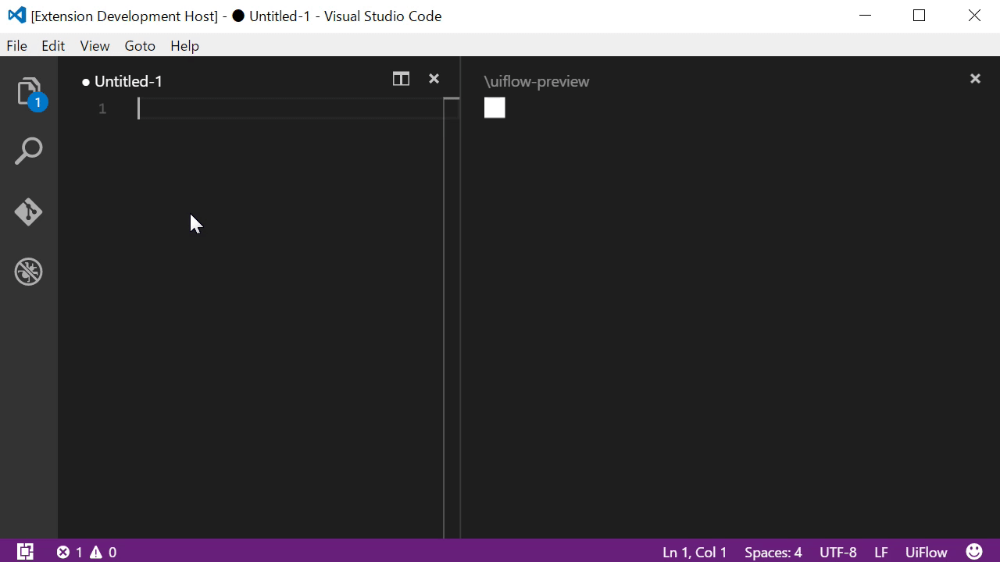

  
 
 

 
# VSCode-UIFlow is UiFlow for Visual Studio Code
This extension adds support for the UiFlow to Visual Studio Code (vscode), including:

* Diagram Preview
* Export PNG, SVG, JSON, DOT
* Auto Completion
* Rename Section and Direction
* Find References
* Open the Source from Preview

## What's uiflow?
[uiflow](https://github.com/hirokidaichi/uiflow) is the simplest way to write down your ui-flow diagram like markdown.

### See also
* [uiflow](https://github.com/hirokidaichi/uiflow) (Japanese)
* [A shorthand for designing UI flows](https://signalvnoise.com/posts/1926-a-shorthand-for-designing-ui-flows)
* [Qiita](https://qiita.com/kexi/items/f5bd25fd4a7da81e62d4) (Japanese)

## Screenshot

## Using
Click Select Langage Mode at the right bottom of the window and choose `UiFlow`.

### Shortcuts
* Show preview `Alt+U P`
* Export PNG `Alt+U E` (also `Alt+U N`)
* Export SVG `Alt+U S`

## Contributing
[How to contribute VSCode-UIFlow](CONTRIBUTING.md)

## Patreon
* [Daichi Hiroki](https://hirokidaichi.github.io) [@hiroki_daichi](https://twitter.com/hiroki_daichi)

